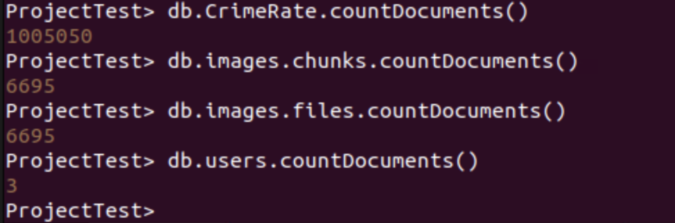

### Technology Stack
We have used a combination of the following technologies:
1. MongoDB - a document database
2. Express — a Node.js framework for building APIs
3. Node.js — a server-side JavaScript runtime environment
4. ReactJS - a JavaScript library used for UI development with shortcut paths and reusable UI components.

We have used ReactJS because it speeds up the (DOM) Document Object Model in the application programming interface (API) and makes code modular and easier to manage.

### Set Up

#### Backend:
1. Create .env file and put MONGO_URI, port and Google Maps API for Google street view.
2. Move into /backend/server.
3. Type `npm install` to install backend dependencies.
4. To run the program, write `node server.js` to run your backend server.

#### Frontend:
1. Move into /frontend/crime-app.
2. Type `npm install` to install frontend dependencies.
3. To run the program, write "npm start" to start you frontend server.

### Process
We have used mongotest_data_dump.js, a JavaScript file, to load the Crime_Data_from_2020_to_Present.csv into a MongoDB collection named CrimeRate in the ProjectTest database.
The script follows the following methodology to load the data:
1. Establishes a MongoDB connection.
2. Clears the database of previous records.
3. Splits the CSV file into lines, stores each line into a JSON object and extracts column headers from the first row.
4. Removes unwanted columns: ["AREA", "Rpt Dist No", "Part 1-2", "Mocodes", "Status", "Crm Cd 1", "Crm Cd 3", "Crm Cd 4"];
5. Converts LAT and LON fields into a GeoJSON Point object and deletes LAT and LON fields after transformation.
6. Stores entries in a batch (batchSize = 50,000) and inserts batches of records into MongoDB.
7. Inserts leftover records that didn’t fit in a batch.

We have used mongotest_data_dump.js, a Node.js Express file, to retrieve Google Street View images associated with crime records and store it in GridFS.

1. Connects to MongoDB and initializes GridFS bucket named "images" for image storage.
2. Retrieves crime records based on latitude & longitude.
3. Fetches Google Street View images for those locations from Google Street View API.
4. Stores images in MongoDB GridFS, linking them to the crime records.
5. Provides an API endpoint (/fetch-image) to check and fetch images.

Backend APIs used:

1. search_with_parameters.js:
1.1 Uses MongoDB Aggregation ($group, $project) to extract crime categories.
1.2 Uses Query Parameters (date_occ, crm_cd_desc) to filter crime records dynamically.
1.3 Handles geolocation data (longitude, latitude) for mapping crime reports.
1.4 Implements Error Handling for missing data, invalid queries, and database errors.

2. advance_search_geospatial.js:
2.1 Accepts two query parameters: 
    location: A place name (e.g., "Los Angeles").
    maxDistance: The radius (in meters) within which to search for crime data.
2.2 Uses Google Maps API to get latitude and longitude for the location. If no results are found, returns a 404 error.
2.3 Uses MongoDB’s $geoNear operator to find crime reports near the given coordinates.
2.4 Extracts longitude & latitude and groups results by crime type.
2.5 Counts the number of times each crime occurred.
2.6 Calls an internal API to fetch an image related to that crime location.
2.7 Returns a list of crime types with the number of occurrences and the imageData associated with the specific coordinate for all coordinates in the maxDistance radius.

3. login.js:
3.1 Defines a UserSchema with 
    name: User’s full name.
    email: Unique identifier for login.
    phoneNumber: Optional phone number.
    password: Hashed password (stored securely).
3.2 Register Endpoint: 
    Accepts user details (name, email, phoneNumber, password) in the request body.
    Creates a new User document in MongoDB.
    Sends 201 Created response upon successful registration.
3.4 Login Endpoint:
    Accepts email and password from the request body.
    Finds user by email in MongoDB.
    If no user is found, returns 404 error.
    Compares hashed password using bcrypt.compare().
    If password is incorrect, returns 400 error.
    Returns 200 OK if login is successful.

4. image_retrieve.js:
4.1 Connects to MongoDB using a URI from .env and creates a GridFS bucket named "images" to store images.
4.3 Uses the existing 'CrimeRate' collection in MongoDB.
4.4 Builds a URL for Google Street View using the latitude and longitude.
4.5 Fetches the image using axios.get() with arraybuffer response.
4.6 Converts the image buffer into a stream for GridFS.
4.7 Defines a unique filename based on coordinates.
4.8 Uploads the image to GridFS with metadata and streams the image into MongoDB.
4.9 Searches for an existing image before fetching a new one and returns existing filename if found in order to avoid              re-downloading.

5. server.js:
5.1 This Express.js API serves as the backend for a MongoDB-powered application. 
5.2 It provides endpoints for user authentication, searching data, geospatial queries, and image retrieval.
5.3 It connects to a MongoDB database, enables CORS for cross-origin requests, and dynamically loads environment variables from 
.env.

Frontend APIs used:

1. AdvanceSearch.js:
This API visualizes crime data on an interactive map by:
1.1 Fetching crime locations near a city
1.2 Retrieving crime data for specific coordinates
1.3 Displaying Google Street View images for crime hotspots

2. App.js:
This React.js application uses React Router to handle navigation between different pages:
2.1 Login Page (/) → Users land here first.
2.2 Dashboard Page (/dashboard) → Users navigate here after logging in.

3. Dashboard.js:
This React dashboard component allows users to:
3.1 Perform Basic Crime Data Search
3.2 Perform Advanced Geospatial Search
3.3 Sign out and return to the login page

4. index.js:
4.1 This code is the entry point for a React application
4.2 Imports the React library, ReactDOM package, global CSS file for styling the app, main App component, and a utility for measuring the performance of the app.

5. login.js:
This code defines a React component for a login and registration page, handling both login and registration forms with different tabs and server-side interaction. 

6. reportWebVitals.js:
This code is a function that measures the performance of a web application using the Web Vitals library. Web Vitals are a set of performance metrics that focus on user experience, like how fast a page loads and how responsive it is. These metrics are key to understanding how users perceive the quality of their web experiences.

7. SearchCrimeData.js:
7.1 This API enables searching for crime data by date and description, and it visually represents the crime data on an interactive map.
7.2 It has the following components:
    inputs: Stores the user input for search criteria (date_occ and crm_cd_desc).
    crimeDescriptions: Holds the list of crime descriptions fetched from the backend.
    results: Stores the crime data results returned from the server.
    error: Displays error messages if the data fetching fails or no results match the search.
7.3 If there are results, a MapContainer from react-leaflet is used to display markers on a map, representing crime locations.
7.4 Each marker is placed based on the latitude and longitude from the crime data, and a popup is displayed with the date and description of the crime.

8. constants.js:
This code is exporting two constants from a JavaScript (or TypeScript) module, which can be used in other parts of the application. They are:
    LOGIN_IMAGE_URL is a string representing the URL of an image (logo), useful for displaying it in the UI.
    DRAWER_WIDTH is a number representing the width of a drawer (set to 200) in pixels, used to manage the layout of the UI.

9. setupTests.js:
Imports the jest-dom library, which is used in combination with Jest and React Testing Library for writing tests that involve DOM elements.

10. App.test.js:
This test checks that after rendering the App component, a link with the text "learn react" is rendered in the DOM. If it is, the test passes; otherwise, it fails.

### Volume
1. db.CrimeRate.countDocuments() = 1005050
2. db.images.chunks.countDocuments() = 6695
3. db.images.files.countDocuments() = 6695
4. db.users.countDocuments() = 3

### Variety
1. Advance Search Inputs: 
    Location: Hollywood 
    Radius: 1000
2. Basic Search Inputs:
    Date: 03/28/2023
    Crime Type: Sex Offender Registrant Out Of Compliance
3. Keyword Search Inputs:
    Crime Type: Theft

### Bells and Whistles
Integrating Google Maps API into the application to generate images of locations from coordinates in real time.

## Glossary for the dataset

This section provides definitions for key terms and variables used in the dataset.

| Column Name        | Description                                                                                                                                                       | API Field Name | Data Type          |
| ------------------ | ----------------------------------------------------------------------------------------------------------------------------------------------------------------- | -------------- | ------------------ |
| **DR_NO**          | Division of Records Number: Official file number made up of a 2-digit year, area ID, and 5 digits                                                                 | dr_no          | Text               |
| **Date Rptd**      | MM/DD/YYYY                                                                                                                                                        | date_rptd      | Floating Timestamp |
| **DATE OCC**       | MM/DD/YYYY                                                                                                                                                        | date_occ       | Floating Timestamp |
| **TIME OCC**       | In 24-hour military time                                                                                                                                          | time_occ       | Text               |
| **AREA NAME**      | The 21 Geographic Areas or Patrol Divisions are also given a name designation that references a landmark or the surrounding community that it is responsible for. | area_name      | Text               |
| **Crm Cd**         | Indicates the crime committed. (Same as Crime Code 1)                                                                                                             | crm_cd         | Text               |
| **Crm Cd Desc**    | Defines the Crime Code provided.                                                                                                                                  | crm_cd_desc    | Text               |
| **Vict Age**       | Two-character numeric representation of victim's age.                                                                                                             | vict_age       | Text               |
| **Vict Sex**       | F - Female, M - Male, X - Unknown                                                                                                                                 | vict_sex       | Text               |
| **Vict Descent**   | Descent Code: Various ethnic/racial classifications.                                                                                                              | vict_descent   | Text               |
| **Premis Cd**      | The type of structure, vehicle, or location where the crime took place.                                                                                           | premis_cd      | Number             |
| **Premis Desc**    | Defines the Premise Code provided.                                                                                                                                | premis_desc    | Text               |
| **Weapon Used Cd** | The type of weapon used in the crime.                                                                                                                             | weapon_used_cd | Text               |
| **Weapon Desc**    | Defines the Weapon Used Code provided.                                                                                                                            | weapon_desc    | Text               |
| **Status Desc**    | Defines the Status Code provided.                                                                                                                                 | status_desc    | Text               |
| **Crm Cd 2**       | Additional crime code, less serious than Crime Code 1.                                                                                                            | crm_cd_2       | Text               |
| **LOCATION**       | Street address of crime incident rounded to the nearest hundred block.                                                                                            | location       | Text               |
| **Cross Street**   | Cross street of rounded address.                                                                                                                                  | cross_street   | Text               |
| **LAT**            | Latitude                                                                                                                                                          | lat            | Number             |
| **LON**            | Longitude                                                                                                                                                         | lon            | Number             |
